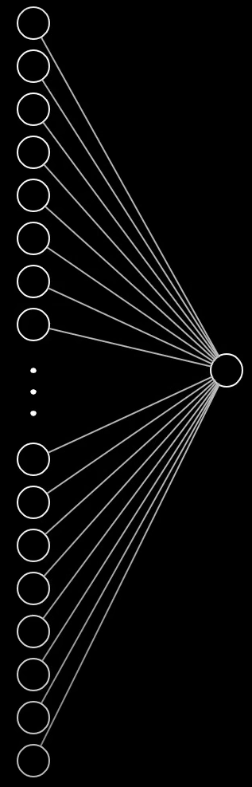
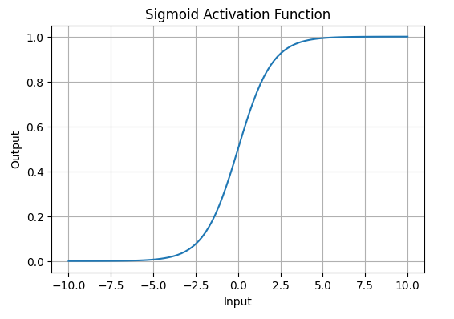

I have understood how the model predicts the answer to whatever we feed it.

There is a neural network.

A neural network has layers. These layers contain neurons (the blue circles). A neuron from one layer is connected to its previous layer's neurons by wires (the white lines shown in the figure are the wires). So one neuron from the last layer will be connected to all the neurons in its previous layer and the second last neuron to its previous layer's neurons and so on. But the first layer does not have a previous layer. This first layer is called the <b>input layer</b>.

> [!Note]
> A neuron is connected to the neurons of its 	previous layer and not all the previous layer<b>s</b>

Now the input layer takes in the input (Such a valuable piece of information this is! The important part in this is the way it takes in the input). A neural network can only take numbers as its input. And, as everything on a computer is actually just numbers, its easy to feed a neural network. Images are just matrices of numbers which corresponds to the amount of red, green and blue in each pixel of that image. Text? Convert each character to it's ASCII value and voila! Conversion is done.

So the input to the neural network has been worked out
> Actually not. When the input is text, just converting the characters to there ASCII values does not help because that can make the length of the input variable. Whereas, the input length should be fixed in a neural network. I will have to find out how it is done for this.

Right now, I don't know how a neural network is trained. So I'm not writing anything about it. But once it is trained, I know how it predicts.

First, there are neurons. What for? They hold a value. Constant? No. The value in the neurons depends on the input.

The image shown above shows the value of each pixel ranging from 0 to 1 denoting how lit the pixel is. The image is of size 28 $\times$ 28. So it has 784 pixels. So we make the input layer of size 784 neurons. Now, each of the neuron in the input layer will have the value of one of the pixel from the image. This is how the neurons in input layer get its values.

Next there are those wires which connect the next layer's neurons to this input layer. This connection should do something right? What this connection does is it helps the neurons in the next layer get its values.

In the neural network shown, there are 4 layers. 1st layer is the input layer. 2nd layer's neurons get their values from the neurons of the first layer. How? Each wire again has a value. Constant? Once the training has finished, yes.

Take one neuron from the second layer connected to all the neurons in the input layer through the wire which have some value. Let these values be denoted by $w_1, w_2, \dots, w_n$. The values are known as weights. We multiply each neuron value from the input layer to its respective weight and then add the result. The value we get is the value of the neuron in the 2nd layer.

These values can be any real number. But we want the neuron to just hold values from 0 to 1. What do we do now? <b>Activation function</b> to the rescue. Activation functions takes in a real number and outputs a value from 0 to 1. Types of activation functions:
<ul>
	<li><b>Sigmoid function:</b></li>
	$$f(x) = \frac{1}{1 + e^{-x}}$$ 

	<li><b>Tanh Activation function:</b></li>
	$$f(x) = \tanh(x) = \frac{2}{1 + e^{-2x}} - 1$$
</ul>
